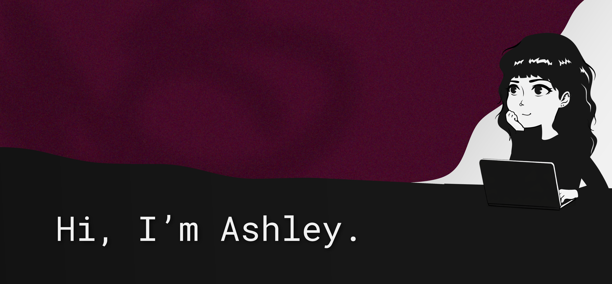

## I build websites, but my real passion is the people and small businesses behind them. Beyond dev work, working alongside creators and business owners to find a brand voice that clicks is my happy place. I’m a recent (as of May 2026) graduate with a BS in full-stack development/graphic information technology. A minor in psychology shapes how I approach my web designs. At the moment I’m focused in front-end development, and mostly work with HTML/CSS & Javascript. Don’t hesitate to reach out, I’d love to find someone to collaborate with! 
<table>
  <tr>
    <td width="20%" align="right" valign="bottom">
      
    </td>
    <td width="80%">
      <h2>See More.</h2>
      
  </tr>
</table>
